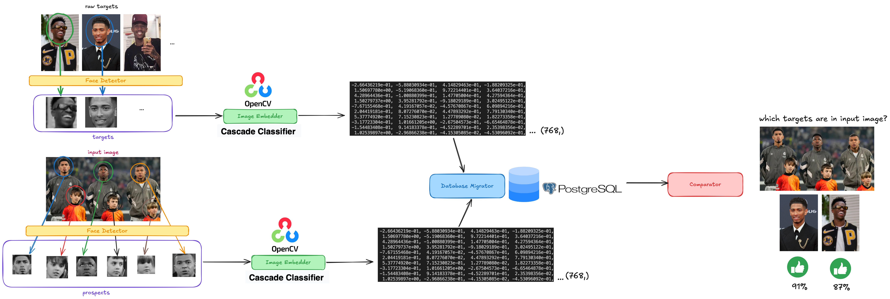

# Biometric Identificator

A Python-based pipeline for detecting faces from input images (prospects) and from a target corpora, generating embeddings, and comparing them to identify matches between target and prospect images. This project leverages computer vision and machine learning techniques to process images and perform biometric identification.

Example use case:


## Features

- **Face Detection**: Detect faces in images using OpenCV's Haar Cascade classifier, which apply sliding window strategy (scanning images in a grid pattern) to the entire image (checking for patterns at every location). OpenCV's haar cascade is a great option for speed, simplicity and limited HW availability.

- **Embedding Generation**: Generate embeddings for detected faces using  Imgbeddings,  a python library which generate vector representation from images using OpenAI's CLIP, a NN used now for analyzing it image and creating embeddings.

- **Database Integration**: Store and retrieve embeddings from a Local PostgreSQL database.
- **Similarity Comparison**: Compare embeddings using various metrics (e.g., cosine similarity, Euclidean distance). The best algorithm for comparisons is cosine similarity  because it's the best suited strategy for high-dimensional representated embeddings and because it is very computationally efficient.
- **Customizable Pipeline**: Easily configure detection parameters and similarity thresholds.

## Project Structure

- **input_images/**: Folder containing the input images for detecting the prospects.
- **raw_targets/**: Folder containing the raw images of the targets we want to detect.
- **prospects/**: Folder where the manipulated data (cropped faces of prospects) is stored after applying the Haar Cascade for face detection.
- **targets/**: Folder where the manipulated data (cropped faces of targets) is stored after applying the Haar Cascade for face detection.

### Files

- **detector.py**: Handles face detection using OpenCV's Haar Cascade. It processes images from the input folders (`input_images` and `raw_targets`) and saves cropped face images to the `prospects` and `targets` folders, respectively.

- **embedder.py**: Generates embeddings for the detected faces using the `imgbeddings` library, which leverages OpenAI's CLIP model to create vector representations of images.

- **migrator.py**: Migrates the generated embeddings to a PostgreSQL database. It ensures that embeddings are stored in a structured format for efficient retrieval and comparison.

- **comparator.py**: Compares embeddings from the database to find matches between targets and prospects. It supports multiple similarity metrics, such as cosine similarity, Euclidean distance, and others.

- **main.py**: Orchestrates the entire pipeline. It:
  1. Detects faces in input images and target images.
  2. Generates embeddings for the detected faces.
  3. Migrates embeddings to the database.
  4. Compares embeddings to identify matches between targets and prospects.

- **etc/**: Contains additional resources, such as the visual summary of the project (`Biometric_Identificator.png`).

- **poetry files**: Lists the Python dependencies required for the project, including opencv-python, imgbeddings, psycopg2, and scikit-learn.

- **README.md**: Provides an overview of the project, its features, structure, and usage instructions.

## Setting Up the Project with Poetry

This project uses [Poetry](https://python-poetry.org/) for dependency management and virtual environment setup. Follow the steps below to set up the project:

### Prerequisites

- Install Poetry by following the instructions on the [Poetry website](https://python-poetry.org/docs/#installation).

### Installation Steps

1. **Create a Virtual Environment**:
   ```bash
   python3 -m venv .venv
   source .venv/bin/activate
   ```

2. **Initialize Poetry**:
```
poetry init
```

3. **Configure Poetry to Use In-Project Virtual Environments**:
```
poetry config virtualenvs.in-project true
```

4. **Install dependencies**:
```
poetry install
```

